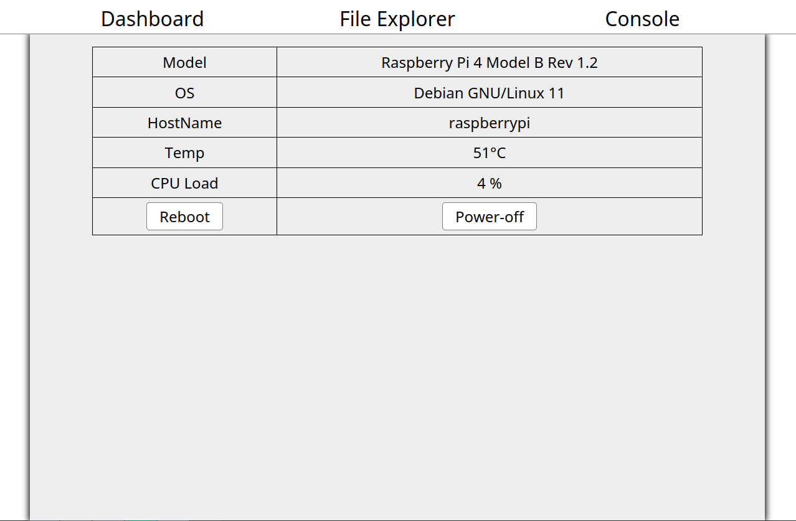
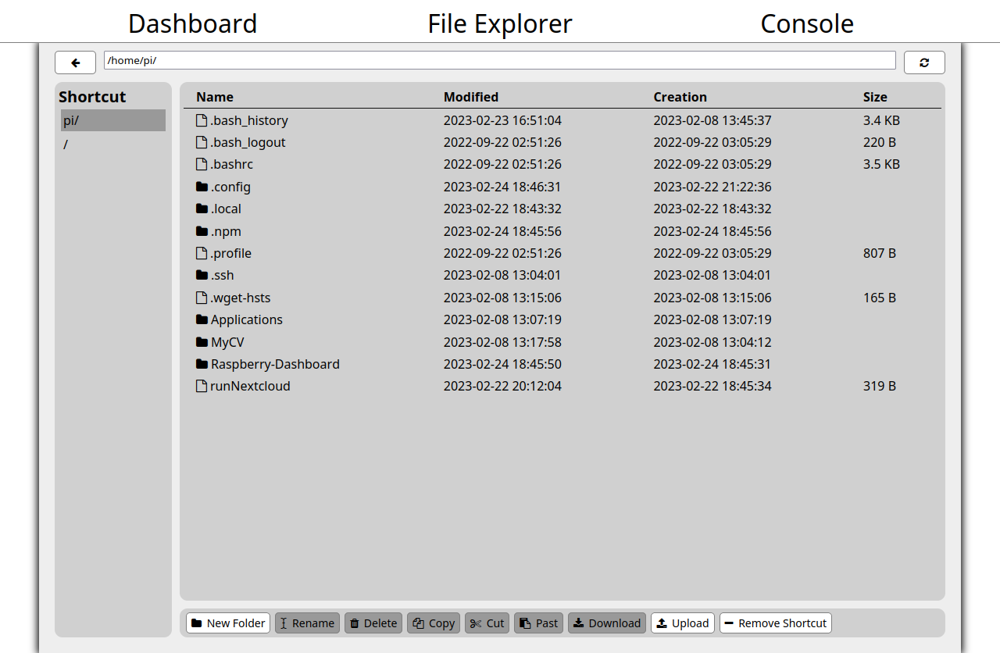
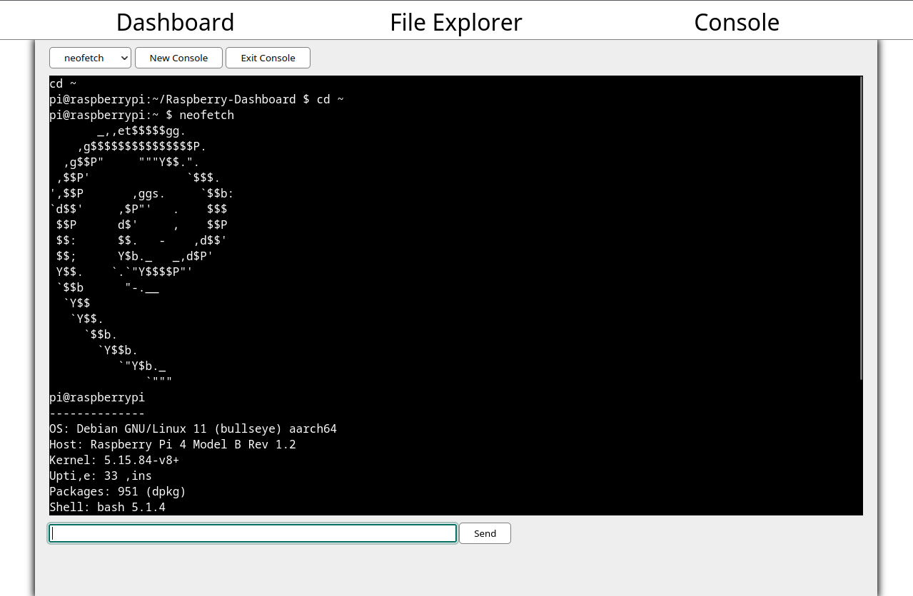

# Presentation

Raspberry Dashboard est une interface web a la base conçue pour monitorer un
Raspberry Pi, même si l'interface peut facilement être portée sur n'importe
quelle linux. L'interface est faite avec nodejs et quelque paquet npm.

## Dashboard

Le premier menu est simplement un tableau d'informations. Il affiche certain
informations essentiel comme le modèle du Raspberry, son système
d'exploitation, la température et la charge du CPU. Il permet aussi d'éteindre
ou de redémarrer le Raspberry.

## File Explorer

Ce panneau est à mon avis le plus utile et le mieux réussie. Le menu File
Explorer implémente un gestionnaire de fichier à l'intérieur du navigateur. On
peut y faire toutes les actions basique et essentiel d'un explorateur de
fichier (Ajouter un dossier, renommer un fichier, supprimer, couper, copier,
coller). L'on peut également Télécharger et Uploader des fichiers. La dernière
fonctionnalité c'est la possibilité de créer des raccourcis.

## Console

Le dernier menu est une tentative d'implémenter un terminal dans un navigateur.
Même si l'on peut faire quelque commande basique sont utilisations reste assez
compliquer il est donc préférable d'utiliser le SSH.

